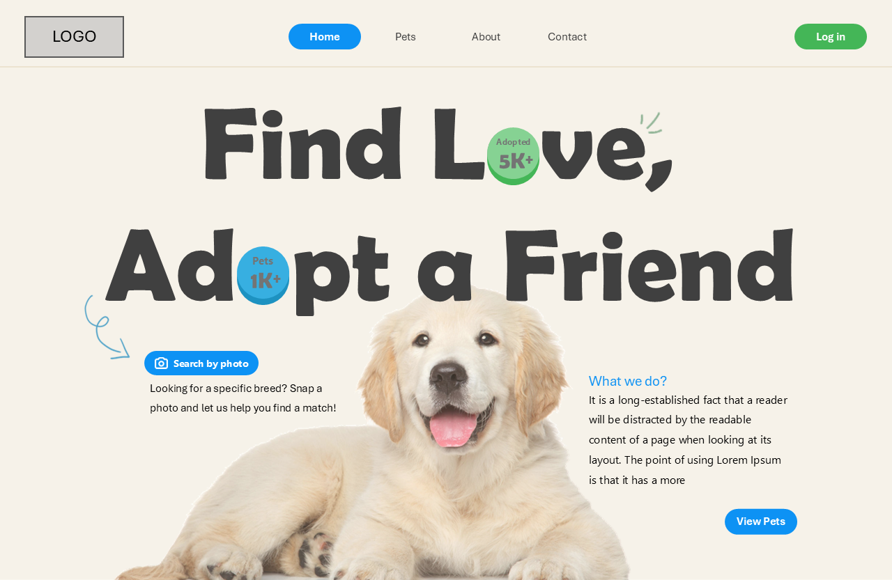
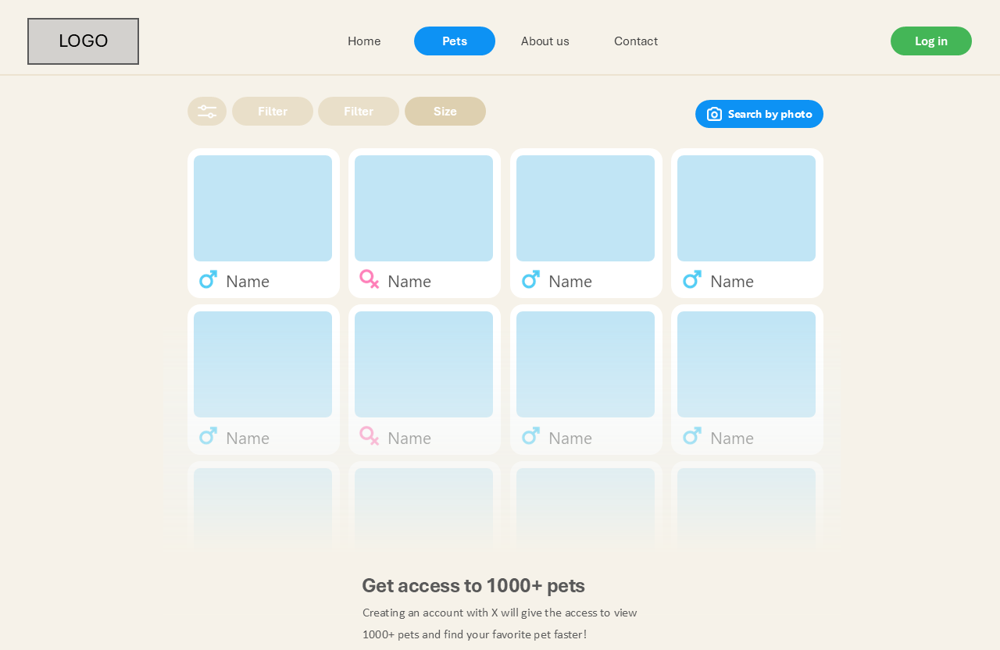
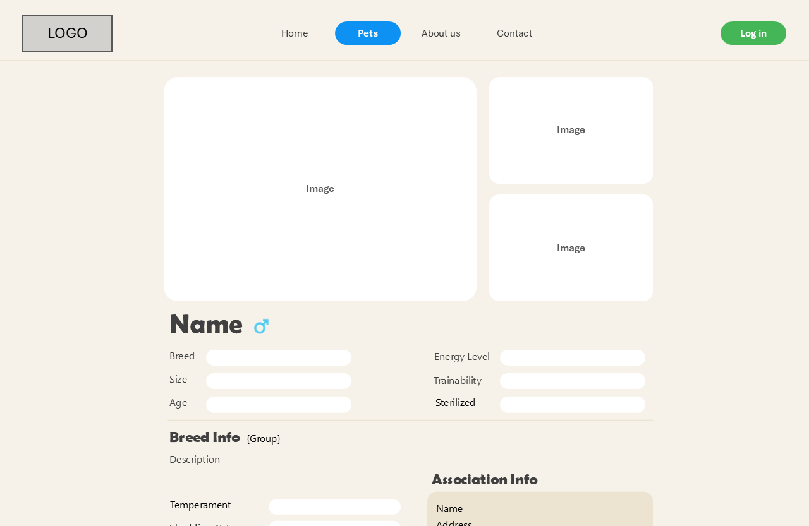
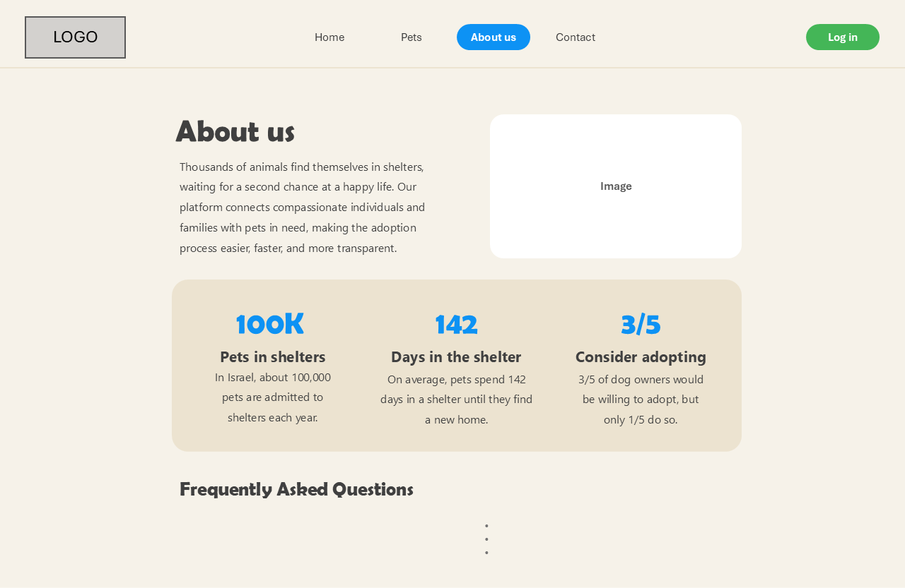

# SophieBoca - Dog Adoption Website

## Project Overview
SophieBoca is a user-friendly platform aimed at connecting people interested in adopting dogs with shelters, foster homes, and animal associations. Our mission is to make the adoption process accessible and efficient for both adopters and organizations, encouraging lasting bonds between dogs and their new families.

## Key Features
1. **User Accounts** - Separate registration for adopters and associations.
2. **Detailed Dog Profiles** - Information on breed, temperament, energy level, health status, and more.
3. **Advanced Search** - Filters by size, age, breed, energy level, and even a photo-based breed matching tool.
4. **Adoption Requests** - Users can submit adoption requests, view statuses, and track adoption history.

## Screenshots

| **Home Page** | **Dogs Page** |
| --- | --- |
|  |  |

| **Dog Profile** | **About Us Page** |
| --- | --- |
|  |  |
